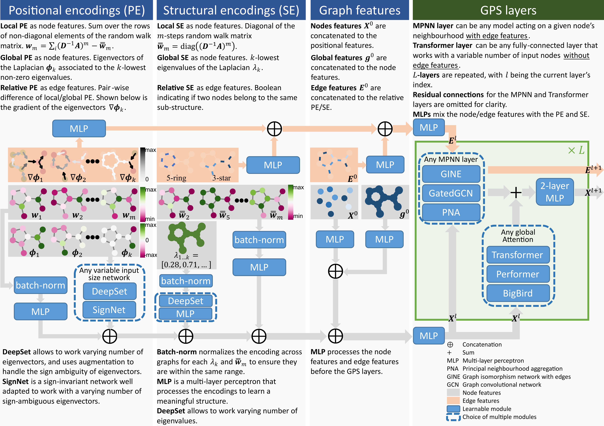

# GraphGPS: General Powerful Scalable Graph Transformers

[](https://arxiv.org/abs/2205.12454)
[](https://paperswithcode.com/sota/graph-regression-on-zinc?p=recipe-for-a-general-powerful-scalable-graph)




How to build a graph Transformer? We provide a 3-part recipe on how to build graph Transformers with linear complexity. Our GPS recipe consists of choosing 3 main ingredients:
1. positional/structural encoding: [LapPE](https://arxiv.org/abs/2106.03893), [RWSE](https://arxiv.org/abs/2110.07875), [SignNet](https://arxiv.org/abs/2202.13013), [EquivStableLapPE](https://arxiv.org/abs/2203.00199)
2. local message-passing mechanism: [GatedGCN](https://arxiv.org/abs/1711.07553), [GINE](https://arxiv.org/abs/1905.12265), [PNA](https://arxiv.org/abs/2004.05718)
3. global attention mechanism: [Transformer](https://arxiv.org/abs/1706.03762), [Performer](https://arxiv.org/abs/2009.14794), [BigBird](https://arxiv.org/abs/2007.14062)

In this *GraphGPS* package we provide several positional/structural encodings and model choices, implementing the GPS recipe. GraphGPS is built using [PyG](https://www.pyg.org/) and [GraphGym from PyG2](https://pytorch-geometric.readthedocs.io/en/2.0.0/notes/graphgym.html).
Specifically *PyG v2.2* is required.


### Python environment setup with Conda

```bash
conda create -n graphgps python=3.10
conda activate graphgps

conda install pytorch=1.13 torchvision torchaudio pytorch-cuda=11.7 -c pytorch -c nvidia
conda install pyg=2.2 -c pyg -c conda-forge
pip install pyg-lib -f https://data.pyg.org/whl/torch-1.13.0+cu117.html

# RDKit is required for OGB-LSC PCQM4Mv2 and datasets derived from it.  
conda install openbabel fsspec rdkit -c conda-forge

pip install pytorch-lightning yacs torchmetrics
pip install performer-pytorch
pip install tensorboardX
pip install ogb
pip install wandb

conda clean --all
```


### Running GraphGPS
```bash
conda activate graphgps

# Running GPS with RWSE and tuned hyperparameters for ZINC.
python main.py --cfg configs/GPS/zinc-GPS+RWSE.yaml  wandb.use False

# Running config with tuned SAN hyperparams for ZINC.
python main.py --cfg configs/SAN/zinc-SAN.yaml  wandb.use False

# Running a debug/dev config for ZINC.
python main.py --cfg tests/configs/graph/zinc.yaml  wandb.use False
```

## Running GraphGPS on OGB-LSC PCQM4Mv2
### Training
```bash
# "small" GPS (GatedGCN+Transformer) with RWSE: 5layers, 304dim, 6152001 params 
python main.py --cfg configs/GPS/pcqm4m-GPS+RWSE.yaml
# "medium" GPS (GatedGCN+Transformer) with RWSE: 10layers, 384dim, 19414641 params
python main.py --cfg configs/GPS/pcqm4m-GPSmedium+RWSE.yaml
# "deep" GPS (GatedGCN+Transformer) with RWSE: 16layers, 256dim, 13807345 params
python main.py --cfg configs/GPS/pcqm4m-GPSdeep+RWSE.yaml
```

### Expected performance
- Note 1: For training we set aside 150k molecules as a custom validation set for the model selection / early stopping.
The official `valid` set is used as the testing set in our training setup.
For running inference on `test-dev` and `test-challenge` look further below.

- Note 2: GPS-medium took ~48h, GPS-deep ~60h to train on a single NVidia A100 GPU. Your reproduced results may slightly vary.

- Note 3: This version of GPS **does not** use 3D atomic position information.

| Model config | parameters | train MAE | custom valid MAE | official valid MAE |
|--------------|-----------:|----------:|-----------------:|-------------------:|
| GPS-small    |  6,152,001 |   0.0638 |           0.0849 |             0.0937 |
| GPS-medium   | 19,414,641 |   0.0726 |           0.0805 |             0.0858 |
| GPS-deep     | 13,807,345 |   0.0641 |           0.0796 |             0.0852 |

### Inference and submission files for OGB-LSC leaderboard
You need a saved pretrained model from the previous step, then run it with an "inference" script that loads official
`valid`, `test-dev`, and `test-challenge` splits, then runs inference, and the official OGB Evaluator.

```bash
# You can download our pretrained GPS-deep (151 MB).
wget https://www.dropbox.com/s/aomimvak4gb6et3/pcqm4m-GPS%2BRWSE.deep.zip
unzip pcqm4m-GPS+RWSE.deep.zip -d pretrained/

# Run inference and official OGB Evaluator.
python main.py --cfg configs/GPS/pcqm4m-GPSdeep-inference.yaml 

# Result files for OGB-LSC Leaderboard.
results/pcqm4m-GPSdeep-inference/0/y_pred_pcqm4m-v2_test-challenge.npz
results/pcqm4m-GPSdeep-inference/0/y_pred_pcqm4m-v2_test-dev.npz
```


## Benchmarking GPS on 11 datasets
See `run/run_experiments.sh` script to run multiple random seeds per each of the 11 datasets. We rely on Slurm job scheduling system.

Alternatively, you can run them in terminal following the example below. Configs for all 11 datasets are in `configs/GPS/`.
```bash
conda activate graphgps
# Run 10 repeats with 10 different random seeds (0..9):
python main.py --cfg configs/GPS/zinc-GPS+RWSE.yaml  --repeat 10  wandb.use False
# Run a particular random seed:
python main.py --cfg configs/GPS/zinc-GPS+RWSE.yaml  --repeat 1  seed 42  wandb.use False
```


### W&B logging
To use W&B logging, set `wandb.use True` and have a `gtransformers` entity set-up in your W&B account (or change it to whatever else you like by setting `wandb.entity`).


## Unit tests

To run all unit tests, execute from the project root directory:

```bash
python -m unittest -v
```

Or specify a particular test module, e.g.:

```bash
python -m unittest -v unittests.test_eigvecs
```


## Citation

If you find this work useful, please cite our NeurIPS 2022 paper:
```bibtex
@article{rampasek2022GPS,
  title={{Recipe for a General, Powerful, Scalable Graph Transformer}}, 
  author={Ladislav Ramp\'{a}\v{s}ek and Mikhail Galkin and Vijay Prakash Dwivedi and Anh Tuan Luu and Guy Wolf and Dominique Beaini},
  journal={Advances in Neural Information Processing Systems},
  volume={35},
  year={2022}
}
```
